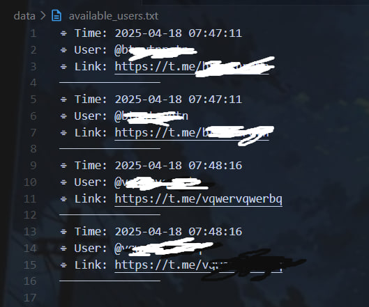

# Telegram Flood Checker V1.0

## Overview
- Version: 1.0
- Type: TG User Checker
- Control: Terminal
- OS: Win, Linux (Ubuntu, Debian), Mac
- Ubuntu: Full Support

## Features
- Check users without tokens
- Support all user types
- Fast & accurate checking
- Simple UI
--------------------------
# Example Output
## Full reports
- Auto save

--------------------------
- Terminal based
- Ubuntu ready

## VPS Servers
### S1 VPS (4GB RAM)
- Speed: 12-15/sec
- Speed: 720-900/min
- Full resources
- Dedicated CPU

### S2 VPS (8GB RAM)
- Speed: 25-35/sec
- Speed: 1500-2100/min
- Full resources
- Dedicated CPU

## Notes
- Depends on network speed
- Depends on CPU power
- Depends on server specs
- Depends on OS
- VPS recommended
- Check only
- Terminal based

## Pricing
- Full Package: $6000
- Subscription Plans:
  - 4GB RAM: $35
  - 8GB RAM: $46

## Contact
- Developer: [Click here to contact](https://t.me/xqxxqqxq)
- Channel: [Click here to join](https://t.me/eeeeeuue)

Note: Do not respond to any other accounts
